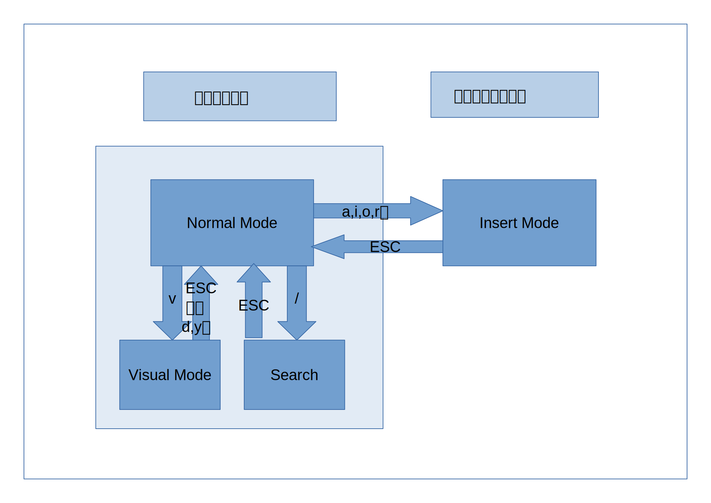
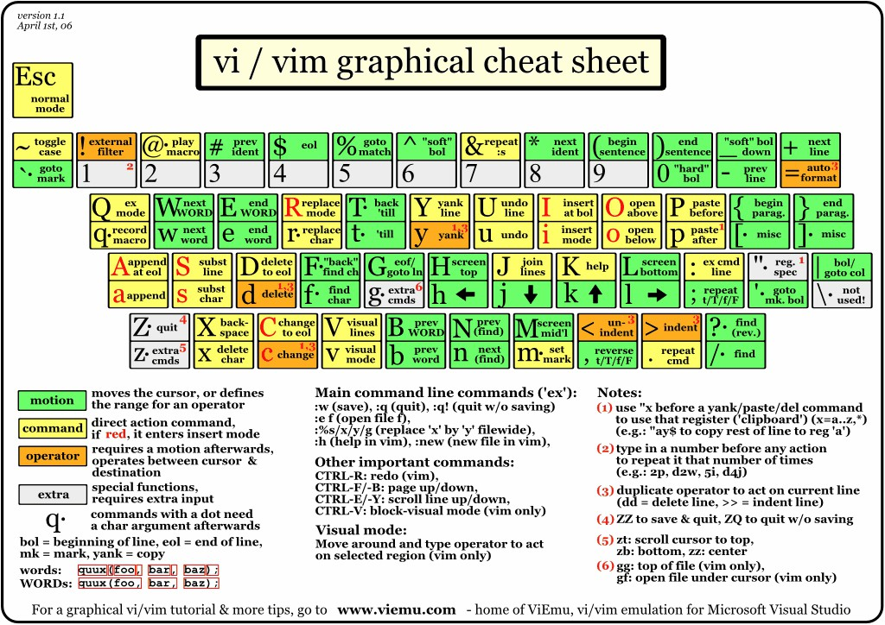

# vim极速上手
## 把vim当作记事本
1. 编程是个文字性工作，因此文本编辑器必不可少。我不敢说vim是最好的编辑器，但是它确实是在Unix界最普及的编辑器。
2. 在bash中用`vim`命令启动vim。后接路径可以用vim打开目标文件。出于历史原因，一些发行版中自带的vim会绑定到命令`vi`上。
3. vim有两种主要的编辑模式——normal mode和insert mode。任何时候如果需要转换到normal mode，就按ESC键。一打开vim，默认的模式也是normal mode。
 
4. 在normal mode下，可以用h、j、k、l向左、下、上、右移动光标，^和$用于移动到一行首尾，C-b和C-f用于向上、下翻页。
5. 除了光标移动命令，还有编辑命令。x可以删除光标所在处字符，X则相当于退格。dd用于删除光标所在行。
6. 被删除的内容会进入缓存，相当于Windows的剪贴板。使用p可以在光标后粘贴剪贴板内容。P则可以在光标前粘贴。
7. 想复制一行内容到剪贴板，不删除原文，就用yy。
8. 按v键进入visual mode，此时移动光标就可以像拖动鼠标那样随意选择要删除或者复制的内容。选好之后按d删除，按y复制。Visual mode就像是normal mode的一个子模式。删除或者复制之后自动回到normal mode，也可以用ESC回到normal mode。
9. 用a,i,o,r等命令进入insert mode，在这个模式下，所有的字符按键都不再作为命令快捷键，按下之后就会输入对应字符。具体来说i和a分别在光标前后开始插入，I和A在行首尾开始插入。O和o在光标所在行前后插入空行。R则开启替换模式，这个模式下新输入的字符可以覆盖原有字符。完成一段输入后，按ESC返回normal mode。
10. 文本插入和除了移动光标以外的命令都属于编辑行为。normal mode下u可以撤销编辑。而`.`可以重复最近一次的编辑。
11. 接下来是查找和替换。`/`键打开查找模式，这时可以输入要查找的内容，按Enter键开始查找。N和n用于在上一处查找结果和下一处查找结果之间切换。ESC键返回normal mode。
12. 更多的功能可以通过底端命令行实现。按`:`打开命令行，Enter执行命令。打开命令行后输入行号执行，就可以跳转到目标行。
13. 再介绍一个用于全局替换的命令，这条命令可以把文中的所有“vim”换成“emacs”：
    >```
    >:%s/vim/emacs/g
    >```
14. 最后是一些和新建，保存，退出有关的命令行命令。w表示保存，q用于在无修改的情况下退出，x表示保存退出，q!表示不保存退出。e后空格，然后接文件路径则是打开或者新建文件：
    >```
    >:e ~/HelloWorld.txt
    >```
15. 学习任何软件，官方的文档总是最重要的。命令行命令h可以打开内置帮助文档。在bash中利用man或info也可以获得vim帮助信息。
## 把vim当作vim
1. 之前一部分所介绍的内容，虽然足够用来简单编辑一些文本，但是远远体现不出vim的特色。如果仅仅使用上一期介绍的内容，可能你根本体会不到vim的快捷和强大之处。本期简单介绍如何利用vim的强大功能。
2. 上一部分简介的命令和快捷键只是vim的九牛一毛，更多快捷键不在这里罗列。附上几张vim的快捷键总结，或许对初学者来说会有所帮助。
    
    
    
3. 如果想要重复一条命令，只需要在按下命令快捷键之前先按下重复次数。例如光标往右移动10格，只要先按1，再按0，然后按j就可以了。
4. 数字不仅仅可以用于表示循环次数。例如11H表示跳转到正数第11行，2L表示跳转到倒数第2行。
5. 有的命令，例如d和y，需要有确切的作用范围才能执行。可以使用visual mode指定其作用范围，也可以在normal mode下先按编辑快捷键再接上光标移动命令为其指定范围。例如删除光标及以后共10个字符，先按d，然后接上10j。当然如果你想的话，还可以在d前头再加上循环次数。例如20d10j就会删掉右边200个字符。注意，visual mode下光标最后停留的位置也在作用域内，而用组合命令的话，光标最后停留的位置不属于作用域。
6. 类似的组合命令用法也可以出现在命令行里。例如把保存退出命令也可以用wq。
7. vim最强大，最特别的地方就在于它的组合命令。刚才所展示的仅仅是一个初级示范。更多充满想象力的操作等着你去发掘。
    


